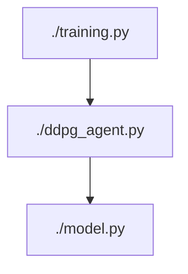

# Udacity Deep Reinforcement Learning - Collaboration Copetition (Project 3)
## Introduction

In this project, the goal is to teach $two$ agents to move $two$ tennis rackets so that they bounce a ball over a net between them for as long as possible. Each of the two agents has access to the environment's 8 dimensional state, which consists of the position and velocity of both the ball and racket. Each of these 8 dimensional states takes on continuous values for each racket agent. From this state, the agent learns which of four actions it should take. Each agent receives a reward of +0.1 if the agent his the ball over the net. If the agent lets the ball his the ground or bounces it out of bounds, it receives a rewar of -0.01. Each agent has two continuous actions available, one for moving towards or away from the net, and one for jumping. The agents have solved the environment when they average a score of +0.5 over 100 consecutive episodes (where the maximum is taken over the two agents).

---
### Requirements:
To replicate this results of this project you need to create a conda environment using python 3.6 and activate it. This can be done as follows for Linux or Mac. (For windows, follow Udacity's [instructions](https://github.com/udacity/deep-reinforcement-learning#dependencies))

>  ```console
>  $ conda create --name drlnd python=3.6
>  $ source activate drlnd
>  (drlnd) $
>  ```

Then in your environment, install OpenAI's gym as follows:
> ```console
> (drlnd) $ git clone https://github.com/openai/gym.git
> (drlnd) $ cd gym
> (drlnd) $ pip install -e .
> ```

After installing gym, you must install Udacity's required python packages as follows:
> ```console
> (drlnd) $ git clone https://github.com/udacity/deep-reinforcement-learning.git
> (drlnd) $ cd deep-reinforcement-learning/python
> (drlnd) $ pip install .
> ```

Then you create a Jupiter notebook kernel that can run the Unity environment provided by Udacity  as follows:
> ```console
> (drlnd) $ python -m ipykernel install --user --name droned --display-name "drlnd"
> ```

When running in the Jupiter notebook you can start your your notebook kernel as shown below.


Next you will download the rebuild Unity Environment at one of these links:

> Linux: [One Agent](https://s3-us-west-1.amazonaws.com/udacity-drlnd/P3/Tennis/Tennis_Linux.zip)
> Linux: [No Visualization - One Agent](https://s3-us-west-1.amazonaws.com/udacity-drlnd/P3/Tennis/Tennis_Linux_NoVis.zip)
>
> ---
> Mac: [One Agent](https://s3-us-west-1.amazonaws.com/udacity-drlnd/P3/Tennis/Tennis.app.zip)

You can then explore the environment by going to the *Udacity DRLND GitHub* ([here](https://github.com/udacity/deep-reinforcement-learning)) repository and open the *Continuous_Control.ipynb* file in the *p2_continuous-control* ([here](https://github.com/udacity/deep-reinforcement-learning/tree/master/p3_collab-compet)).

## Training
To train, in your terminal run the following:
> ```console
> (drlnd) $ python3 ./training.py
> ```



This will run a Deep Deterministic Policy Gradients with the following default hyper parameters:
>```console
> (drlnd) $ python3 ./training.py \
> --n_episodes 400 \
> --max_t 1000 \
> --BUFFER_SIZE 1e5 \
> --BATCH_SIZE 64 \
> --GAMMA 0.99 \
> --TAU 1e-3 \
> --LR_ACTOR 1e-4 \
> --LR_CRITIC 1e-4 \
> --CRITIC_WEIGHT_DECAY 0 \
> --fc1_units 400 \
> --fc2_units 300 \
> --seed 42 \
> --model_num 1 \
> ```

### Multiple Model Training (not in parallel, Unity will crash)

To train multiple agents (and have it run in the background, in your terminal run the following:
> ```console
> (drlnd) $ nohup python3 MultiModel.py &
> ```

You can edit the loops inside MultiModel.py to control what hyper-parameters you train with. 
