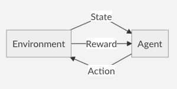
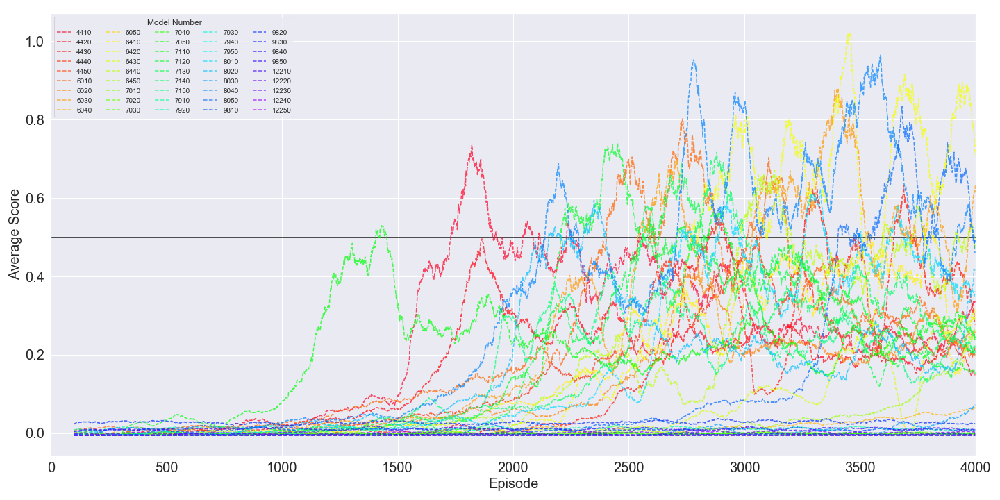

# Tennis (Project 3) - Report

To solve this environment, I started with the Deep Deterministic Policy Gradients using an Actor Critic Neural Network that was shown earlier in this section of the class. 

As with any Reinforcement Learning problem, it can be boiled down to:
As an Agent in a State, what action do I take to maximize the Reward the Environment will give me.

# Deep Deterministic Policy Gradients (DDPG)

DDPG is an approach for reinforcement learning environments where an agent uses a policy as a function that has a probability of taking an action given a state. For following through with this action, the agent receives a reward. A policy is said to be good if it results in a large reward over an episode of the environment. The optimal policy is the policy that maximizes the the reward obtained while following the policy. This environment being continuous would make using a Q-Learning Network approach fail where instead you are trying to figure out what is the best specific action. Instead we use two neural networks to approximate two values. The first network is called the Actor which is used to approximate the optimal policy where as the second network is the Critic which tries to estimate the reward from following that approximately optimal policy. This becomes a “try the policy” then “evaluate the policy” then “improve the policy” loop where the actor tries the policy and the critic evaluates the policy. The improving step comes from the actor and critic network updating through their loss functions. 

This is the general structure of what the method uses but there are some additional moving parts behind the scenes. This implementation uses Ornstein Uhlenbeck noise, a replay buffer, target networks, and soft updating. 

When first starting the training process, the actor and critic network are randomly initialized. During an episode at a time step, the actor network is given the current state and returns a value that is added to the Ornstein noise. This action is taken giving a new state as well as a reward for taking the previous action. This is then stored in the Replay Buffer in the form of a tuple (State, Action, Reward, NextState). Once the replay buffer has enough transitions, a random sample of them is taken and is used to help the critic network. The critic network is evaluated at the new state with an action given by the actor network evaluated at the new state. This value can be thought of as an approximation of the next reward from taking the next state, or expected Q value. Then both networks are updated, first the critic then the actor. This takes form of the mean squared error between the expected Q value and the actual Q value during a transition. The actor uses gradient ascent to update the actor network towards a better policy. Another more subtle issue that is run into is that if we update our networks every chance we get, it has the potential to become very unstable. To mitigate this problem, we will actually use two neural networks for both the actor and critic, although in the end we only care about one. The networks are our main actor network, main critic network, our target actor network and our target critic network. The target networks are held static for a fixed number of training steps while training the main networks as the goal of what the main network should be working towards. When the target networks are updated, they are pushed towards the main networks but do not get replaced completely by the main networks. This is called soft updating and makes things run much more smoothly.

# Results
I ran many experiments with different hyper parameters. The ones I chose to vary were as follows: the learning rate (GAMMA), the number of units in the first convolutional layer (fc1_units) of each network, the number of units in the second convolutional layer (fc2_units) of each network, the learning rate of the Actor network (LR_ACTOR), and the learning rate of the Critic network (LR_CRITIC).

GAMMA takes on values = [0.95, 0.97, 0.99, 1.00]
fc1_units takes on values = [100, 200, 400]
fc2_units takes on values = [100, 200, 400]
LR_ACTOR takes on values = [1e-3, 1e-4]
LR_CRITIC takes on values = [1e-3, 1e-4]

All other hyper parameters were the defaults set by training.py (also shown in README.md)

This gives 4 (GAMMA) * 3 (fc1_units) * 3 (fc2_units) * 2 (LR_ACTOR) * 2 (LR_CRITIC) = 144 total models trained.

The neural network architecture is as follows:

The results are shown below (the horizontal black line is the value required to be considered solved):

After this grid search for hyper parameters, I took the 5 best models (models 60, 94, 96, 130, 132) and re-trained using new starting seeds for initialization. I trained 5 new seeds (10, 20, 30, 40, 50) to find which model performs best.

These results of these 25 newly trained models are shown below where the model number is the original model number with the seed appended to the end of the value.

These 5 models statistics are shown below.

| model | mean  | std   | min   | 25%   | 50%   | 75%    | max   |
|-------|-------|-------|-------|-------|-------|--------|-------|
| 94    | 101.0 | 2.16  | 99.0  | 99.75 | 100.5 | 101.75 | 104.0 |
| 130   | 101.6 | 3.29  | 99.0  | 99.0  | 101.0 | 102.0  | 107.0 |
| 60    | 103.6 | 1.82  | 101.0 | 103.0 | 104.0 | 104.0  | 106.0 |
| 132   | 113.6 | 18.7  | 104.0 | 105.0 | 105.0 | 107.0  | 147.0 |
| 96    | 141.4 | 85.32 | 102.0 | 102.0 | 104.0 | 105.0  | 294.0 |

It can be seen that model 94 turned out to be the best model even though it came in second in the initial grid search for the best hyper parameters!
With GAMMA = 0.99, LR_ACTOR = 1e-3, fc1_units = 200, fc2_units = 400.

The results for all-models and the seed-models are shown (sorted by win_iter) in the tables in the Appendix - A and Appendix - B respectively.

The best models can be found [here]().

# Future Work!

Since this is a continuous state space, a subset of the other methods out there are an option. This includes using PPO, A3C, or D4PG to take advantage of being able to train multiple agents in parallel together.

# Appendix - A (All-Model Results)
| model     | GAMMA | LR_ACTOR | LR_CRITIC | fc1_units | fc2_units | win_iter |
|-----------|-------|----------|-----------|-----------|-----------|----------|
| model-58  | 0.95  | 0.0010   | 0.0001    | 200       | 400       | 99.0     |
| model-94  | 0.99  | 0.0010   | 0.0001    | 200       | 400       | 99.0     |
| model-96  | 0.99  | 0.0001   | 0.0001    | 200       | 400       | 99.0     |
| model-132 | 1.0   | 0.0001   | 0.0001    | 200       | 400       | 99.0     |
| model-60  | 0.95  | 0.0001   | 0.0001    | 200       | 400       | 99.0     |
| model-130 | 1.0   | 0.0010   | 0.0001    | 200       | 400       | 99.0     |
| model-66  | 0.95  | 0.0010   | 0.0001    | 400       | 200       | 100.0    |
| model-104 | 0.99  | 0.0001   | 0.0001    | 400       | 200       | 101.0    |
| model-138 | 1.0   | 0.0010   | 0.0001    | 400       | 200       | 101.0    |
| model-144 | 1.0   | 0.0001   | 0.0001    | 400       | 400       | 101.0    |
| model-102 | 0.99  | 0.0010   | 0.0001    | 400       | 200       | 103.0    |
| model-134 | 1.0   | 0.0010   | 0.0001    | 400       | 100       | 103.0    |
| model-62  | 0.95  | 0.0010   | 0.0001    | 400       | 100       | 103.0    |
| model-90  | 0.99  | 0.0010   | 0.0001    | 200       | 200       | 104.0    |
| model-54  | 0.95  | 0.0010   | 0.0001    | 200       | 200       | 104.0    |
| model-32  | 0.9   | 0.0001   | 0.0001    | 400       | 200       | 105.0    |
| model-30  | 0.9   | 0.0010   | 0.0001    | 400       | 200       | 105.0    |
| model-72  | 0.95  | 0.0001   | 0.0001    | 400       | 400       | 105.0    |
| model-84  | 0.99  | 0.0001   | 0.0001    | 100       | 400       | 105.0    |
| model-126 | 1.0   | 0.0010   | 0.0001    | 200       | 200       | 105.0    |
| model-48  | 0.95  | 0.0001   | 0.0001    | 100       | 400       | 106.0    |
| model-82  | 0.99  | 0.0010   | 0.0001    | 100       | 400       | 106.0    |
| model-36  | 0.9   | 0.0001   | 0.0001    | 400       | 400       | 106.0    |
| model-46  | 0.95  | 0.0010   | 0.0001    | 100       | 400       | 107.0    |
| model-56  | 0.95  | 0.0001   | 0.0001    | 200       | 200       | 108.0    |
| model-114 | 1.0   | 0.0010   | 0.0001    | 100       | 200       | 108.0    |
| model-78  | 0.99  | 0.0010   | 0.0001    | 100       | 200       | 108.0    |
| model-10  | 0.9   | 0.0010   | 0.0001    | 100       | 400       | 108.0    |
| model-98  | 0.99  | 0.0010   | 0.0001    | 400       | 100       | 109.0    |
| model-142 | 1.0   | 0.0010   | 0.0001    | 400       | 400       | 109.0    |
| model-42  | 0.95  | 0.0010   | 0.0001    | 100       | 200       | 110.0    |
| model-6   | 0.9   | 0.0010   | 0.0001    | 100       | 200       | 110.0    |
| model-120 | 1.0   | 0.0001   | 0.0001    | 100       | 400       | 110.0    |
| model-128 | 1.0   | 0.0001   | 0.0001    | 200       | 200       | 111.0    |
| model-92  | 0.99  | 0.0001   | 0.0001    | 200       | 200       | 111.0    |
| model-12  | 0.9   | 0.0001   | 0.0001    | 100       | 400       | 112.0    |
| model-122 | 1.0   | 0.0010   | 0.0001    | 200       | 100       | 112.0    |
| model-116 | 1.0   | 0.0001   | 0.0001    | 100       | 200       | 113.0    |
| model-88  | 0.99  | 0.0001   | 0.0001    | 200       | 100       | 113.0    |
| model-18  | 0.9   | 0.0010   | 0.0001    | 200       | 200       | 113.0    |
| model-100 | 0.99  | 0.0001   | 0.0001    | 400       | 100       | 115.0    |
| model-118 | 1.0   | 0.0010   | 0.0001    | 100       | 400       | 115.0    |
| model-136 | 1.0   | 0.0001   | 0.0001    | 400       | 100       | 116.0    |
| model-70  | 0.95  | 0.0010   | 0.0001    | 400       | 400       | 116.0    |
| model-14  | 0.9   | 0.0010   | 0.0001    | 200       | 100       | 118.0    |
| model-38  | 0.95  | 0.0010   | 0.0001    | 100       | 100       | 119.0    |
| model-86  | 0.99  | 0.0010   | 0.0001    | 200       | 100       | 119.0    |
| model-64  | 0.95  | 0.0001   | 0.0001    | 400       | 100       | 121.0    |
| model-80  | 0.99  | 0.0001   | 0.0001    | 100       | 200       | 121.0    |
| model-76  | 0.99  | 0.0001   | 0.0001    | 100       | 100       | 123.0    |
| model-74  | 0.99  | 0.0010   | 0.0001    | 100       | 100       | 125.0    |
| model-4   | 0.9   | 0.0001   | 0.0001    | 100       | 100       | 126.0    |
| model-40  | 0.95  | 0.0001   | 0.0001    | 100       | 100       | 127.0    |
| model-50  | 0.95  | 0.0010   | 0.0001    | 200       | 100       | 129.0    |
| model-110 | 1.0   | 0.0010   | 0.0001    | 100       | 100       | 130.0    |
| model-8   | 0.9   | 0.0001   | 0.0001    | 100       | 200       | 131.0    |
| model-112 | 1.0   | 0.0001   | 0.0001    | 100       | 100       | 133.0    |
| model-5   | 0.9   | 0.0010   | 0.0010    | 100       | 200       | 135.0    |
| model-140 | 1.0   | 0.0001   | 0.0001    | 400       | 200       | 135.0    |
| model-44  | 0.95  | 0.0001   | 0.0001    | 100       | 200       | 143.0    |
| model-68  | 0.95  | 0.0001   | 0.0001    | 400       | 200       | 144.0    |
| model-113 | 1.0   | 0.0010   | 0.0010    | 100       | 200       | 159.0    |
| model-71  | 0.95  | 0.0001   | 0.0010    | 400       | 400       | 164.0    |
| model-124 | 1.0   | 0.0001   | 0.0001    | 200       | 100       | 165.0    |
| model-17  | 0.9   | 0.0010   | 0.0010    | 200       | 200       | 185.0    |
| model-19  | 0.9   | 0.0001   | 0.0010    | 200       | 200       | 203.0    |
| model-91  | 0.99  | 0.0001   | 0.0010    | 200       | 200       | 236.0    |
| model-81  | 0.99  | 0.0010   | 0.0010    | 100       | 400       | 243.0    |
| model-67  | 0.95  | 0.0001   | 0.0010    | 400       | 200       | 253.0    |
| model-7   | 0.9   | 0.0001   | 0.0010    | 100       | 200       | 270.0    |
| model-43  | 0.95  | 0.0001   | 0.0010    | 100       | 200       | 289.0    |
| model-41  | 0.95  | 0.0010   | 0.0010    | 100       | 200       | 301.0    |
| model-39  | 0.95  | 0.0001   | 0.0010    | 100       | 100       | 328.0    |
| model-11  | 0.9   | 0.0001   | 0.0010    | 100       | 400       | 329.0    |
| model-52  | 0.95  | 0.0001   | 0.0001    | 200       | 100       | 343.0    |
| model-108 | 0.99  | 0.0001   | 0.0001    | 400       | 400       | 380.0    |
| model-1   | 0.9   | 0.0010   | 0.0010    | 100       | 100       |          |
| model-101 | 0.99  | 0.0010   | 0.0010    | 400       | 200       |          |
| model-103 | 0.99  | 0.0001   | 0.0010    | 400       | 200       |          |
| model-105 | 0.99  | 0.0010   | 0.0010    | 400       | 400       |          |
| model-106 | 0.99  | 0.0010   | 0.0001    | 400       | 400       |          |
| model-107 | 0.99  | 0.0001   | 0.0010    | 400       | 400       |          |
| model-109 | 1.0   | 0.0010   | 0.0010    | 100       | 100       |          |
| model-111 | 1.0   | 0.0001   | 0.0010    | 100       | 100       |          |
| model-115 | 1.0   | 0.0001   | 0.0010    | 100       | 200       |          |
| model-117 | 1.0   | 0.0010   | 0.0010    | 100       | 400       |          |
| model-119 | 1.0   | 0.0001   | 0.0010    | 100       | 400       |          |
| model-121 | 1.0   | 0.0010   | 0.0010    | 200       | 100       |          |
| model-123 | 1.0   | 0.0001   | 0.0010    | 200       | 100       |          |
| model-125 | 1.0   | 0.0010   | 0.0010    | 200       | 200       |          |
| model-127 | 1.0   | 0.0001   | 0.0010    | 200       | 200       |          |
| model-129 | 1.0   | 0.0010   | 0.0010    | 200       | 400       |          |
| model-13  | 0.9   | 0.0010   | 0.0010    | 200       | 100       |          |
| model-131 | 1.0   | 0.0001   | 0.0010    | 200       | 400       |          |
| model-133 | 1.0   | 0.0010   | 0.0010    | 400       | 100       |          |
| model-135 | 1.0   | 0.0001   | 0.0010    | 400       | 100       |          |
| model-137 | 1.0   | 0.0010   | 0.0010    | 400       | 200       |          |
| model-139 | 1.0   | 0.0001   | 0.0010    | 400       | 200       |          |
| model-141 | 1.0   | 0.0010   | 0.0010    | 400       | 400       |          |
| model-143 | 1.0   | 0.0001   | 0.0010    | 400       | 400       |          |
| model-15  | 0.9   | 0.0001   | 0.0010    | 200       | 100       |          |
| model-16  | 0.9   | 0.0001   | 0.0001    | 200       | 100       |          |
| model-3   | 0.9   | 0.0001   | 0.0010    | 100       | 100       |          |
| model-31  | 0.9   | 0.0001   | 0.0010    | 400       | 200       |          |
| model-33  | 0.9   | 0.0010   | 0.0010    | 400       | 400       |          |
| model-34  | 0.9   | 0.0010   | 0.0001    | 400       | 400       |          |
| model-35  | 0.9   | 0.0001   | 0.0010    | 400       | 400       |          |
| model-37  | 0.95  | 0.0010   | 0.0010    | 100       | 100       |          |
| model-45  | 0.95  | 0.0010   | 0.0010    | 100       | 400       |          |
| model-47  | 0.95  | 0.0001   | 0.0010    | 100       | 400       |          |
| model-49  | 0.95  | 0.0010   | 0.0010    | 200       | 100       |          |
| model-51  | 0.95  | 0.0001   | 0.0010    | 200       | 100       |          |
| model-53  | 0.95  | 0.0010   | 0.0010    | 200       | 200       |          |
| model-55  | 0.95  | 0.0001   | 0.0010    | 200       | 200       |          |
| model-57  | 0.95  | 0.0010   | 0.0010    | 200       | 400       |          |
| model-59  | 0.95  | 0.0001   | 0.0010    | 200       | 400       |          |
| model-61  | 0.95  | 0.0010   | 0.0010    | 400       | 100       |          |
| model-63  | 0.95  | 0.0001   | 0.0010    | 400       | 100       |          |
| model-65  | 0.95  | 0.0010   | 0.0010    | 400       | 200       |          |
| model-69  | 0.95  | 0.0010   | 0.0010    | 400       | 400       |          |
| model-73  | 0.99  | 0.0010   | 0.0010    | 100       | 100       |          |
| model-75  | 0.99  | 0.0001   | 0.0010    | 100       | 100       |          |
| model-77  | 0.99  | 0.0010   | 0.0010    | 100       | 200       |          |
| model-79  | 0.99  | 0.0001   | 0.0010    | 100       | 200       |          |
| model-83  | 0.99  | 0.0001   | 0.0010    | 100       | 400       |          |
| model-85  | 0.99  | 0.0010   | 0.0010    | 200       | 100       |          |
| model-87  | 0.99  | 0.0001   | 0.0010    | 200       | 100       |          |
| model-89  | 0.99  | 0.0010   | 0.0010    | 200       | 200       |          |
| model-9   | 0.9   | 0.0010   | 0.0010    | 100       | 400       |          |
| model-93  | 0.99  | 0.0010   | 0.0010    | 200       | 400       |          |
| model-95  | 0.99  | 0.0001   | 0.0010    | 200       | 400       |          |
| model-97  | 0.99  | 0.0010   | 0.0010    | 400       | 100       |          |
| model-99  | 0.99  | 0.0001   | 0.0010    | 400       | 100       |          |

# Appendix B - (Seed-Model Results)
| model       | GAMMA | LR_ACTOR | LR_CRITIC | fc1_units | fc2_units | seed | win_iter |
|-------------|-------|----------|-----------|-----------|-----------|------|----------|
| model-13020 | 1.0   | 0.0010   | 0.0001    | 200       | 400       | 20   | 99.0     |
| model-13040 | 1.0   | 0.0010   | 0.0001    | 200       | 400       | 40   | 99.0     |
| model-9430  | 0.99  | 0.0010   | 0.0001    | 200       | 400       | 30   | 99.0     |
| model-9450  | 0.99  | 0.0010   | 0.0001    | 200       | 400       | 50   | 100.0    |
| model-13010 | 1.0   | 0.0010   | 0.0001    | 200       | 400       | 10   | 101.0    |
| model-9410  | 0.99  | 0.0010   | 0.0001    | 200       | 400       | 10   | 101.0    |
| model-6010  | 0.95  | 0.0001   | 0.0001    | 200       | 400       | 10   | 101.0    |
| model-9610  | 0.99  | 0.0001   | 0.0001    | 200       | 400       | 10   | 102.0    |
| model-9650  | 0.99  | 0.0001   | 0.0001    | 200       | 400       | 50   | 102.0    |
| model-13050 | 1.0   | 0.0010   | 0.0001    | 200       | 400       | 50   | 102.0    |
| model-6030  | 0.95  | 0.0001   | 0.0001    | 200       | 400       | 30   | 103.0    |
| model-13230 | 1.0   | 0.0001   | 0.0001    | 200       | 400       | 30   | 104.0    |
| model-9640  | 0.99  | 0.0001   | 0.0001    | 200       | 400       | 40   | 104.0    |
| model-6040  | 0.95  | 0.0001   | 0.0001    | 200       | 400       | 40   | 104.0    |
| model-9440  | 0.99  | 0.0010   | 0.0001    | 200       | 400       | 40   | 104.0    |
| model-6020  | 0.95  | 0.0001   | 0.0001    | 200       | 400       | 20   | 104.0    |
| model-13250 | 1.0   | 0.0001   | 0.0001    | 200       | 400       | 50   | 105.0    |
| model-13210 | 1.0   | 0.0001   | 0.0001    | 200       | 400       | 10   | 105.0    |
| model-9630  | 0.99  | 0.0001   | 0.0001    | 200       | 400       | 30   | 105.0    |
| model-6050  | 0.95  | 0.0001   | 0.0001    | 200       | 400       | 50   | 106.0    |
| model-13030 | 1.0   | 0.0010   | 0.0001    | 200       | 400       | 30   | 107.0    |
| model-13240 | 1.0   | 0.0001   | 0.0001    | 200       | 400       | 40   | 107.0    |
| model-13220 | 1.0   | 0.0001   | 0.0001    | 200       | 400       | 20   | 147.0    |
| model-9620  | 0.99  | 0.0001   | 0.0001    | 200       | 400       | 20   | 294.0    |
| model-9420  | 0.99  | 0.0010   | 0.0001    | 200       | 400       | 20   |          |
